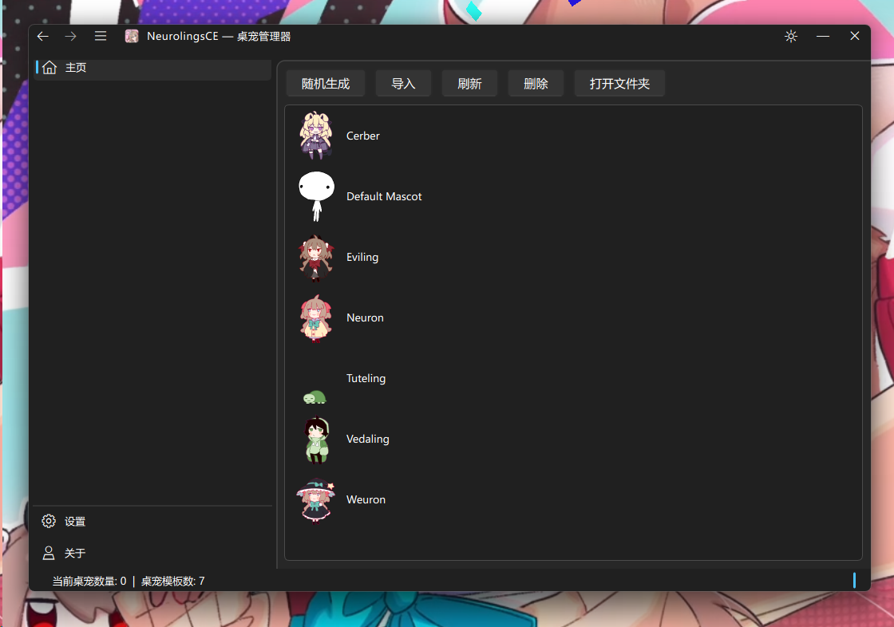

#  NeurolingsCE

**English | [中文](README.md)**

A cross-platform desktop mascot (Shimeji) application, extensively modified from [Shijima-Qt](https://github.com/pixelomer/Shijima-Qt).

Built with C++17 / Qt6, supporting Windows, Linux, and macOS.



## Features

- 🖥️ Cross-platform support (Windows / Linux / macOS)
- 🎭 Compatible with Shimeji-ee format mascot packs
- 📦 Drag-and-drop mascot pack import
- 🪟 Window mode — run mascots in standalone sandbox windows
- 🖱️ Mouse interaction — drag, right-click menu
- 📡 HTTP REST API (`localhost:32456`)
- 🌐 Multi-language support (English / Simplified Chinese)
- 🔊 Optional sound effects (Qt Multimedia)
- 🖥️ Multi-monitor support
- 📐 Custom scaling

## Download

Neurolings Core is the release version of this project, while Neurolings is the one-click installation package for this project.

- [Latest Release](https://github.com/qingchenyouforcc/NeurolingsCE/releases/latest)
- [All Releases](https://github.com/qingchenyouforcc/NeurolingsCE/releases)

## Documentation

📖 **[Wiki](https://github.com/qingchenyouforcc/NeurolingsCE/wiki)** — Full documentation including getting started, build guide, architecture, HTTP API, FAQ, and more.

## Building

### Prerequisites

- C++17 compiler (MSVC 2022 / GCC / Clang)
- Qt 6.8+ (Core, Gui, Widgets, Concurrent, LinguistTools)
- CMake 3.21+ (Windows/MSVC) or Make (Linux/macOS)

Initialize the remaining external submodules first (`libshimejifinder`, `cpp-httplib`, and `ElaWidgetTools`):

```bash
git submodule update --init --recursive
```

### Windows (MSVC + CMake)

```bash
cmake -B build -G Ninja -DCMAKE_BUILD_TYPE=Release -DQt6_DIR=D:/Qt/6.8.3/msvc2022_64/lib/cmake/Qt6
cmake --build build
```

You can also open the project directly in Visual Studio — `CMakeSettings.json` includes pre-configured `x64-Debug` and `x64-Release` profiles.

#### Quick Packaging For The Windows bin Directory

If you already built `out/build/x64-Release/bin` with Visual Studio/CMake, run:

```powershell
powershell -ExecutionPolicy Bypass -File .\src\tools\package-windows-bin.ps1
```

By default the script:

- reads `VERSION.txt` to generate the output folder name
- copies `out/build/x64-Release/bin` to `out/package/NeurolingsCE_windows_x86_64_v<version>`
- appends `a` automatically when `VERSION_NAME=Alpha`, for example `NeurolingsCE_windows_x86_64_v0.3.0a`
- excludes `log/`, `shijima_stdout.txt`, and `shijima_stderr.txt`
- creates a zip archive for quick sharing or as MSI input

Common options:

```powershell
powershell -ExecutionPolicy Bypass -File .\src\tools\package-windows-bin.ps1 `
  -SourceDir out/build/x64-Release/bin `
  -OutputRoot out/package `
  -SkipVcRedist `
  -SkipZip
```

#### Windows MSI (WiX)

The repository now also includes a WiX-based MSI entrypoint. Recommended flow:

1. Run `package-windows-bin.ps1` to create a clean staged package directory
2. Run `installer/wix/build-msi.ps1` to build the MSI
3. If you want `vc_redist.x64.exe` chained into the install flow, run `installer/wix/build-bundle.ps1` to build the bootstrapper EXE

```powershell
powershell -ExecutionPolicy Bypass -File .\installer\wix\build-msi.ps1
```

```powershell
powershell -ExecutionPolicy Bypass -File .\installer\wix\build-bundle.ps1
```

If WiX is not installed yet, you can still generate the `.wxs` files first:

```powershell
powershell -ExecutionPolicy Bypass -File .\installer\wix\build-msi.ps1 -GenerateOnly
```

### Windows (MinGW Cross-Compilation via Docker)

```bash
docker build -t neurolingsce-dev dev-docker
docker run -e CONFIG=release --rm -v "$(pwd)":/work neurolingsce-dev bash -c 'mingw64-make -j$(nproc)'
```

### Linux

After installing Qt6 development dependencies:

```bash
CONFIG=release make -j$(nproc)
```

### macOS

1. Install dependencies via MacPorts:

```bash
sudo port install qt6-qtbase qt6-qtmultimedia pkgconfig libarchive
```

2. Build:

```bash
CONFIG=release make -j$(nproc)
```

## Platform Notes

### Windows

Only x64 toolchain is supported. Tested on Windows 11; Windows 10 should also work. Window tracking works out of the box.

### Linux

Supports KDE Plasma 6 and GNOME 46 (Wayland / X11). On first run, a shell plugin is automatically installed to obtain foreground window information:
- **KDE** — Transparent to the user, no action needed.
- **GNOME** — Requires re-login after first run to restart the Shell. The application will prompt accordingly.
- **Other desktop environments** — Window tracking is not available.

### macOS

Requires Accessibility permission to obtain foreground window information. Minimum system version: macOS 13.

## HTTP API

A built-in HTTP REST API runs at `http://127.0.0.1:32456`, allowing external programs to control mascots.

See detailed documentation at [src/docs/HTTP-API.md](src/docs/HTTP-API.md).

## CLI

The project now provides a dedicated console CLI binary, `NeurolingsCE-cli`.
Template-management commands run standalone; runtime mascot-control commands
auto-start the NeurolingsCE runtime when needed, then talk to it over local IPC.

- Global options: `--quiet`, `--json`, `--connect-timeout-ms`, `--read-timeout-ms`
- Document-style commands: `--help/-h`, `--summon/-s`, `--close`, `--close-all`, `--stop`, `--mascot/-m`, `--list/-l`, `--version/-v`
- `--summon` supports two forms:
  - `--summon mascot --name NAME [label]`
  - `--summon mascot --data-id ID [label]`
  - `--summon random [label]`
- `label` is a user-facing CLI label, not the runtime mascot ID, and only lasts for the current app run
- `--mascot/-m` supports template management:
  - `--mascot list`
  - `--mascot add ZIP`
  - `--mascot remove MASCOT`
- `--mascot/-m` does not require the main app to be running; it directly reads and writes the local template directory
- `--stop` closes all mascots and stops the NeurolingsCE runtime; if no runtime is running, it does not start one just to stop it
- Legacy commands remain supported: `list`, `list-loaded`, `spawn`, `alter`, `dismiss`, `dismiss-all`
- `--json` emits stable structured success payloads and error objects
- `--host` and `--port` are no longer supported; the CLI no longer uses HTTP
- On Windows, call `NeurolingsCE-cli.exe` so shells and agents can reliably read exit codes

See [src/docs/HTTP-API.md](src/docs/HTTP-API.md) for command syntax.

## NeurolingsCE-Skill

The repository also includes a companion skill at `neurolingsce-skill/`. It teaches agents to control already-installed mascot templates through `NeurolingsCE-cli.exe`.

- Skill display name: `NeurolingsCE-Skill`
- Machine name: `neurolingsce-skill`
- Default behavior: call `NeurolingsCE-cli.exe` only; unless the user explicitly asks for it, do not start `NeurolingsCE.exe`, do not open the GUI, and do not start runtime mode
- Semantic rule: when a user says "generate a xxx mascot/desktop pet", interpret that as summoning an **installed template**, not generating mascot assets, images, sprites, XML, or ZIP packs
- If the requested template is missing, the agent should say that the template is not installed or not found, rather than creating a new mascot or substituting a different one

Helper scripts:

```powershell
python neurolingsce-skill/scripts/find_neurolingsce_cli.py
python neurolingsce-skill/scripts/summon_companion.py
```

- `find_neurolingsce_cli.py`: searches explicit paths, common build outputs, `PATH`, and common install locations for `NeurolingsCE-cli.exe`, then records the result in `neurolingsce-skill/cache/neurolingsce-cli-path.json`
- `summon_companion.py`: summons one random **non-default** installed mascot; if only the default template exists, it reports that no non-default template is available and does not create resources

## Project Structure

```
NeurolingsCE/
├── src/app/              # Qt application layer (split into core/runtime/ui)
├── src/platform/Platform/ # Platform abstraction (Windows/Linux/macOS)
├── include/shijima-qt/   # Public headers
├── src/app/core/shijima-engine/ # Integrated core mascot simulation engine source
├── libshimejifinder/     # [submodule] Mascot pack import/extraction
├── cpp-httplib/          # [submodule] HTTP server (header-only)
├── translations/         # i18n translation files
├── cmake/                # CMake helper scripts
├── src/assets/           # Bundled default mascot assets
└── src/packaging/        # Desktop entry, icons, AppStream metadata
```

`src/app` is now organized into three responsibility-focused layers:

- `src/app/core/`: asset loading, audio, HTTP API, and archive import helpers
- `src/app/runtime/`: `ShijimaManager` environment sync, import workflow, lifecycle, and runtime scheduling
- `src/app/ui/`: manager window setup, tray integration, page builders, mascot widget interaction, dialogs, and widgets

Implementation slices follow a `Subject + Responsibility` naming style such as `ManagerImportWorkflow.cc`, `ManagerWindowSetup.cc`, and `MascotWidgetRendering.cc`, so file names map more directly to business logic.

## Credits

This project is based on [Shijima-Qt](https://github.com/pixelomer/Shijima-Qt) by [pixelomer](https://github.com/pixelomer), with extensive modifications and feature enhancements.

This project was originally created as a migration version for "[Neurolings](https://x.com/Monikaphobia/status/1844272129619132682?s=20)", but is now being transformed into a general-purpose Shimeji desktop pet core manager program.

Core dependencies:
- [libshijima](https://github.com/pixelomer/libshijima) — Mascot simulation engine, integrated into `src/app/core/shijima-engine`
- [libshimejifinder](https://github.com/pixelomer/libshimejifinder) — Mascot pack parser
- [cpp-httplib](https://github.com/yhirose/cpp-httplib) — HTTP library
- [Qt 6](https://www.qt.io/) — GUI framework

ICO credits:
- Thanks to [宅笙Zhai_Sheng](https://space.bilibili.com/49541366) for creating the application ICO

## Contact

- **Author**: [轻尘呦](https://space.bilibili.com/178381315)
- **Repository**: https://github.com/qingchenyouforcc/NeurolingsCE
- **Bug Reports**: [GitHub Issues](https://github.com/qingchenyouforcc/NeurolingsCE/issues)
- **Feedback QQ Group**: 423902950
- **Chat QQ Group**: 125081756

**Interested in Neuro community project development?**

**Contact me to join NeuForge Center**

**Join STNC to learn more**

**STNC Swarm Tech Intelligence Center QQ Group: 125081756**

**STNC Project Feedback QQ Group: 423902950**

## License

This project is open-sourced under the [GNU General Public License v3.0](LICENSE).

The upstream Shijima-Qt README is available at [Shijima-Qt_README.md](Shijima-Qt_README.md).


---
## Ads

(If you need promotion, please contact me.)

---

## Star History

[](https://star-history.com/#qingchenyouforcc/NeurolingsCE&Date)
